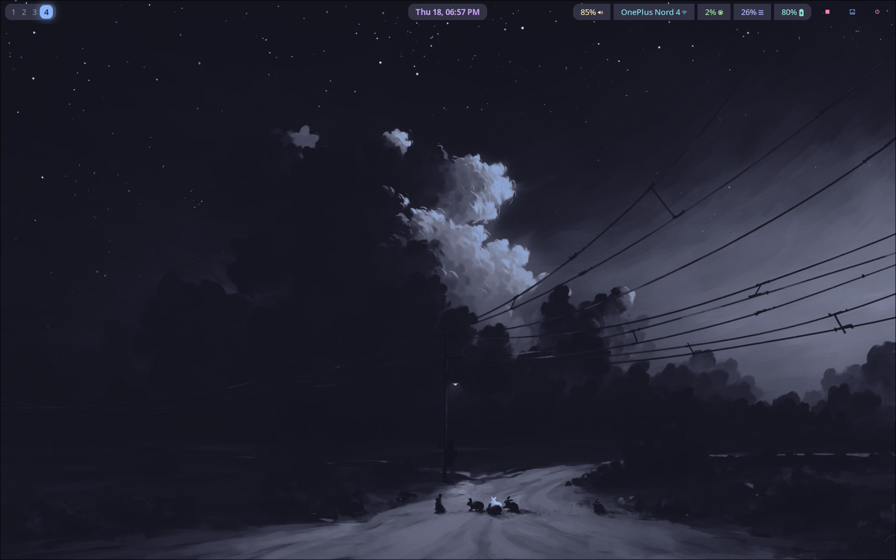
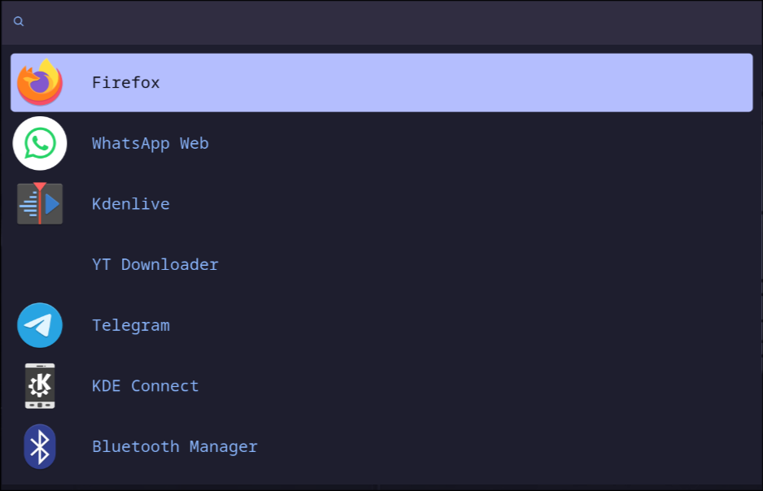

# Dotfiles — Catppuccin Mocha Hyprland

Personal dotfiles for [Hyprland](https://hyprland.org/) on **Fedora 44**, themed with **Catppuccin Mocha** and deployed via [GNU Stow](https://www.gnu.org/software/stow/).

## Gallery

| Desktop | Rofi Launcher |
|---------|---------------|
|  |  |

## Stack

| Component | Choice |
|-----------|--------|
| **WM** | Hyprland |
| **Bar** | Waybar |
| **Launcher** | Rofi (Catppuccin Mocha) |
| **Terminal** | Kitty + Ghostty |
| **Shell** | Zsh + Powerlevel10k + zoxide |
| **Wallpaper** | Hyprpaper (random Catppuccin wallpapers) |
| **Clipboard** | Cliphist |
| **Notifications** | Dunst |
| **Auth** | polkit-kde-agent |

## Layout

```
Dotfiles/
├── hypr/        → ~/.config/hypr/
│   ├── hyprland.conf      # Main config (modular)
│   ├── keybinds.conf      # All keybindings
│   ├── monitors.conf      # Monitor setup
│   ├── colors.conf        # Catppuccin Mocha colors
│   ├── decorations.conf   # Borders, shadows, blur
│   ├── animations.conf    # Window animations
│   ├── windowrules.conf   # Window rules
│   ├── hyprpaper.conf     # Wallpaper config
│   └── Scripts/           # Custom scripts
├── kitty/       → ~/.config/kitty/
├── ghostty/     → ~/.config/ghostty/
├── waybar/      → ~/.config/waybar/
│   ├── config.jsonc
│   ├── style.css          # Catppuccin Mocha
│   ├── power_menu.xml     # GTK power menu
│   └── scripts/
├── rofi/        → ~/.config/rofi/
│   ├── config.rasi          # Config + vim bindings
│   ├── catppuccin-mocha.rasi # Theme (bundled)
└── zsh/         → ~/.zshrc, ~/.p10k.zsh
```

## Keybindings

| Key | Action |
|-----|--------|
| `SUPER + Return` | Open terminal (Kitty) |
| `SUPER + D` | Rofi launcher |
| `SUPER + E` | File manager (Dolphin) |
| `SUPER + A` | Firefox |
| `SUPER + W` | Wi-Fi settings |
| `SUPER + B` | Bluetooth settings |
| `SUPER + Q` | Close window |
| `SUPER + V` | Toggle floating |
| `SUPER + J` | Toggle split |
| `SUPER + [1-0]` | Switch workspace |
| `SUPER + SHIFT + [1-0]` | Move window to workspace |
| `SUPER + N` | New workspace |
| `SUPER + P` | Power menu |
| `SUPER + M` | Exit Hyprland |
| `SUPER + S` | Suspend prompt |
| `SUPER + O` | Open Obsidian daily note |
| `Print` | Screenshot to clipboard |
| `ALT + TAB` | Cycle workspaces |
| `ALT + 4` | Shutdown in 5s |

## Features

- **Modular config** — hyprland.conf sources separate files per concern
- **Waybar** — grouped right modules (audio, network, CPU, memory, battery) with a unified `surface0` background and rounded edges, plus a GTK power menu
- **Rofi** — vim-like keybindings (Ctrl+h/j/k/l), Catppuccin Mocha theme (bundled)
- **Hyprpaper** — random wallpaper from `~/Pictures/catppuccin-wallpapers` on startup
- **Clipboard** — cliphist with clipboard manager
- **Zsh** — Oh My Zsh with Powerlevel10k (Pure-style), zoxide for smart `cd`, syntax highlighting, autosuggestions
- **Screenshots** — bound to Print key, saves to clipboard
- **Media keys** — volume, brightness, playback controls

## Deploy

```bash
# Clone into ~/Dotfiles
git clone git@github.com:code-with-aneesh/dotfiles.git ~/Dotfiles

# Stow each package
stow -d ~/Dotfiles -t ~ hypr
stow -d ~/Dotfiles -t ~ kitty
stow -d ~/Dotfiles -t ~ waybar
stow -d ~/Dotfiles -t ~ rofi
stow -d ~/Dotfiles -t ~ ghostty
stow -d ~/Dotfiles -t ~ zsh

# Restow after changes
stow -d ~/Dotfiles -t ~ -R hypr
```

## Dependencies

- Hyprland, Waybar, Rofi, Kitty, Ghostty
- Oh My Zsh, Powerlevel10k, zoxide, fzf
- Hyprpaper, Cliphist, Dunst
- Papirus-Dark icon theme
- Catppuccin wallpapers (`~/Pictures/catppuccin-wallpapers/`)
- FiraCode Nerd Font

## Credits

- [Catppuccin](https://github.com/catppuccin) for the color scheme
- [Hyprland](https://hyprland.org/) for the WM
